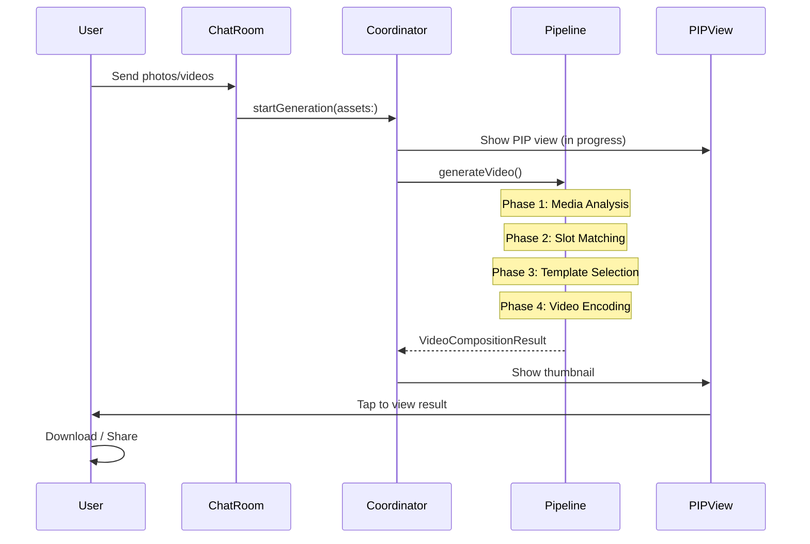
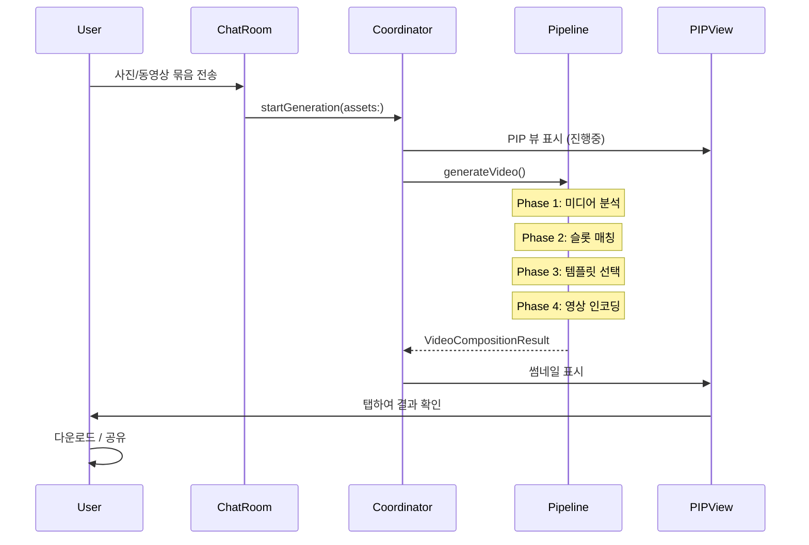
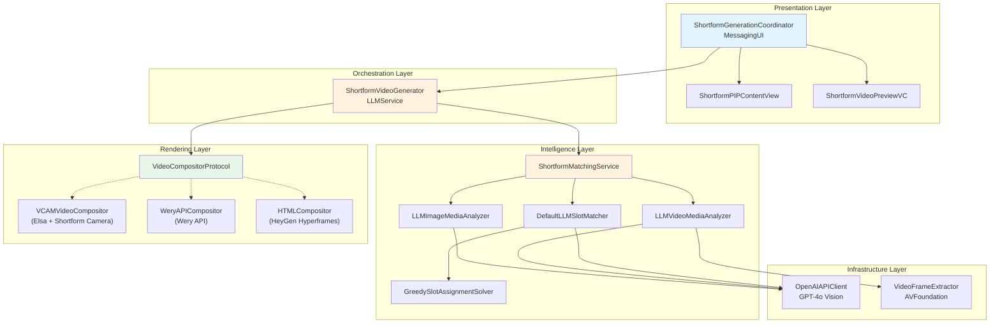
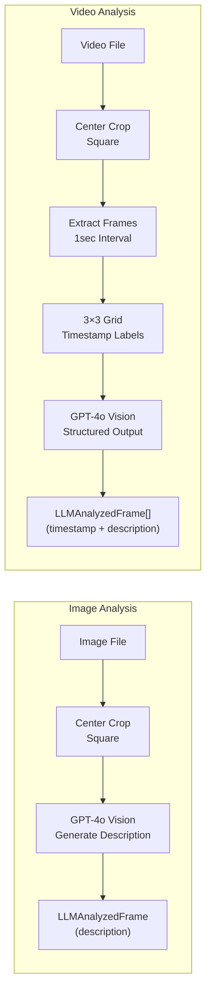
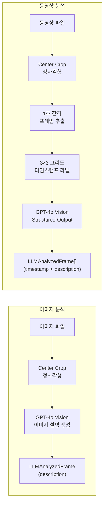
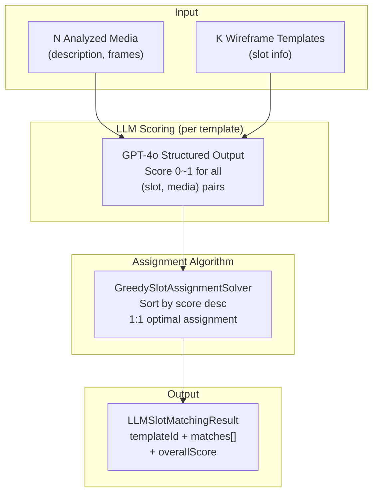
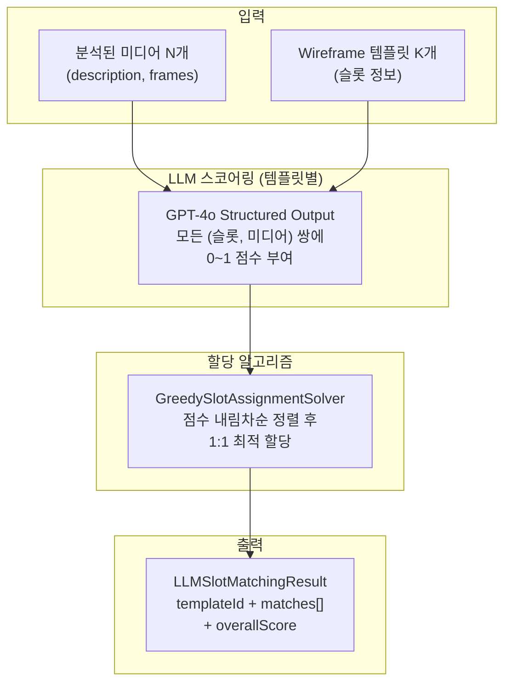
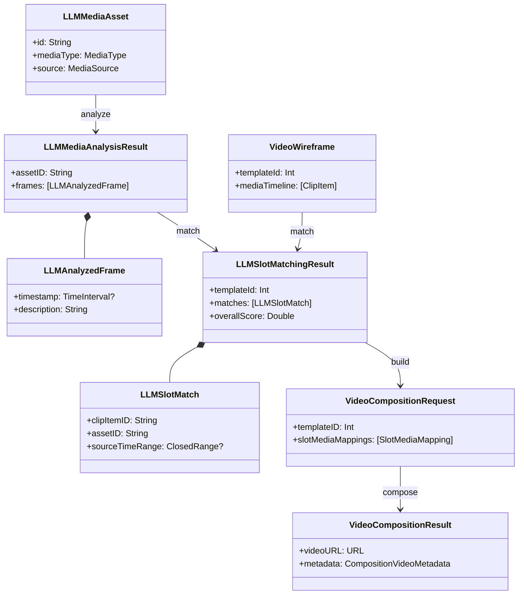

## Responsibilities

- Designed and implemented end-to-end pipeline that analyzes photos/videos with LLM (GPT-4o) and automatically matches them to Shortform video templates
- Built image/video frame analyzer using GPT-4o Vision API with Structured Output
- Developed optimal template selection system using LLM-based slot scoring + Greedy assignment algorithm
- Architected multi-rendering backend via VideoCompositorProtocol abstraction
- Implemented PIP (Picture-in-Picture) based background generation progress UI
- Conducted quality validation and token usage/cost analysis across 7 media sets

## About

A PoC project that automatically analyzes photos/videos shared in Messenger chat rooms using AI, matches them to optimal shortform video templates, and generates completed shortform videos. The core focus is leveraging LLM's "contextual understanding" to comprehend media composition, mood, and narrative flow, then optimally place them into template slots.

---

## Responsibilities (한국어)

- 사진/동영상을 LLM(GPT-4o)으로 분석하여 Shortform 영상 템플릿에 자동 매칭하는 End-to-End 파이프라인 설계 및 구현
- GPT-4o Vision API를 활용한 이미지/동영상 프레임 분석기 구현 (Structured Output)
- LLM 기반 슬롯 스코어링 + Greedy 할당 알고리즘을 통한 최적 템플릿 선택 시스템 개발
- VideoCompositorProtocol 추상화를 통한 멀티 렌더링 백엔드 아키텍처 설계
- PIP(Picture-in-Picture) 기반 백그라운드 생성 진행률 UI 구현
- 7개 미디어셋에 대한 품질 검증 및 토큰 사용량/비용 분석

## About (한국어)

Messenger 채팅방에서 공유된 사진/동영상을 AI가 자동으로 분석하여, 최적의 Shortform 숏폼 영상 템플릿에 매칭하고 완성된 숏폼을 생성하는 PoC 프로젝트. LLM의 "맥락을 읽는 능력"을 적극 활용하여 미디어의 구도, 분위기, 서사적 흐름을 이해하고 템플릿 슬롯에 최적 배치하는 것이 핵심.

---

<!-- lang:en -->
## Background

- Photos/videos in messenger apps are typically shared for special events (workshops, gatherings, trips, etc.)
- PoC started from the idea: "Can AI automatically create high-quality shortform videos from this media?"
- Using LLM's Vision capabilities to understand composition, mood, and subjects of each media, then optimally place them into template slots

## User Flow

1. After a gathering with friends, share photos taken together in the chat room
2. Service triggers when multiple media messages are sent as a bundle to the chat room
3. After background video generation, display results in PIP view when shortform is ready
4. User can view, download, and share the completed video (detailed editing not supported)
<!-- /lang:en -->

<!-- lang:ko -->
## 배경

- Messenger에서 사진/동영상은 보통 특별한 이벤트(워크샵, 모임, 여행 등)를 공유할 때 사용됨
- 이 미디어를 활용하여 AI가 자동으로 퀄리티 높은 숏폼을 제작할 수 있지 않을까 하는 아이디어에서 PoC 시작
- LLM의 Vision 능력으로 각 미디어의 구도·분위기·피사체를 파악하고, 영상 템플릿의 각 슬롯에 적절히 배치

## 유저 플로우

1. 친구들과의 모임 후, 서로 찍은 사진을 채팅방에 공유
2. 채팅방에 여러 미디어 메시지가 묶음으로 전송되면 서비스가 트리거
3. 백그라운드에서 영상 제작 후, 숏폼이 준비되면 PIP 뷰로 결과를 표시
4. 유저는 완성된 영상을 확인·다운로드·공유 가능 (상세 수정은 미지원)
<!-- /lang:ko -->





---

<!-- lang:en -->
## Architecture Design

### Module Structure

The entire codebase is isolated at compile time via Feature Flag `FEATURE_POC_SHORTFORM_GENERATOR`, completely separated from production code.
<!-- /lang:en -->

<!-- lang:ko -->
## 아키텍처 설계

### 전체 모듈 구조

Feature Flag `FEATURE_POC_SHORTFORM_GENERATOR`로 전체 코드가 컴파일 타임에 격리되어 있으며, 프로덕션 코드와 완전히 분리됨.
<!-- /lang:ko -->



<!-- lang:en -->
### Dependency Structure

```
MessagingUI (Coordinator + PIP UI)
  └─ LLMServiceInterface (protocols, models)
  └─ LLMService (implementation)
  └─ AINativeUI (PIP overlay)

LLMService (pipeline implementation)
  └─ LLMServiceInterface
  └─ AVFoundation (video frame extraction/crop)
  └─ CoreGraphics (image processing)

AppDelegate (bootstrap)
  └─ ShortformVideoGeneratorProvider registration
  └─ VideoWireframeServiceProvider registration
```

### DI/Provider Pattern

Using Provider pattern for dependency inversion between modules. Protocols and Providers are defined in `LLMServiceInterface`, and implementations are injected in `AppDelegate`.
<!-- /lang:en -->

<!-- lang:ko -->
### 의존성 구조

```
MessagingUI (Coordinator + PIP UI)
  └─ LLMServiceInterface (프로토콜, 모델)
  └─ LLMService (구현체)
  └─ AINativeUI (PIP 오버레이)

LLMService (파이프라인 구현)
  └─ LLMServiceInterface
  └─ AVFoundation (영상 프레임 추출/크롭)
  └─ CoreGraphics (이미지 처리)

AppDelegate (부트스트랩)
  └─ ShortformVideoGeneratorProvider 등록
  └─ VideoWireframeServiceProvider 등록
```

### DI/Provider 패턴

모듈 간 의존성 역전을 위해 Provider 패턴을 사용. `LLMServiceInterface`에 프로토콜과 Provider를 정의하고, `AppDelegate`에서 구현체를 주입.
<!-- /lang:ko -->

```swift
// LLMServiceInterface - 프로토콜 정의
public protocol ShortformVideoGeneratorProtocol: Sendable {
    func generateVideo(
        assets: [LLMMediaAsset],
        wireframes: [VideoWireframe],
        progressHandler: RenderingProgressHandler?
    ) async throws -> VideoCompositionResult
}

// AppDelegate - 구현체 등록
ShortformVideoGeneratorProvider.makeGenerator = { usageTracker in
    let client = OpenAIAPIClient(apiKey: apiKey, model: "gpt-4o")
    let imageAnalyzer = LLMImageMediaAnalyzer(apiClient: client)
    let videoAnalyzer = LLMVideoMediaAnalyzer(apiClient: client)
    let matcher = DefaultLLMSlotMatcher(apiClient: client)
    let matchingService = ShortformMatchingService(...)
    return ShortformVideoGenerator(
        matchingService: matchingService,
        compositor: VCAMVideoCompositor(...)
    )
}
```

---

<!-- lang:en -->
## 4-Phase Pipeline Details

### Phase 1: Media Analysis

Analyze images and videos using GPT-4o Vision API to extract natural language descriptions.
<!-- /lang:en -->

<!-- lang:ko -->
## 4-Phase 파이프라인 상세

### Phase 1: 미디어 분석 (Media Analysis)

이미지와 동영상을 GPT-4o Vision API로 분석하여 자연어 설명을 추출.
<!-- /lang:ko -->





<!-- lang:en -->
**Image Analysis (LLMImageMediaAnalyzer)**
- Send images to GPT-4o to generate one-sentence descriptions
- Covers main subjects, composition (close-up/medium/wide), mood, background, visual characteristics
- Prompt example: *"A young woman smiling warmly in a cozy cafe, close-up shot with soft ambient lighting."*

**Video Analysis (LLMVideoMediaAnalyzer)**
- Extract frames at 1-second intervals, arrange into 3×3 grid images
- Add timestamp labels to each tile so GPT-4o can identify positions
- Return per-frame descriptions via Structured Output (JSON)

**Center Crop Preprocessing**
- Since shortforms are typically vertical, horizontal images/videos are center-cropped to square
- Images: `CGImage.cropping(to:)` + JPEG encoding
- Videos: Crop using `AVMutableVideoComposition` + `AVAssetExportSession` (preserving audio)

### Phase 2: Slot Matching

Match analyzed media to slots in each template. Send structured JSON to GPT-4o for scoring.
<!-- /lang:en -->

<!-- lang:ko -->
**이미지 분석 (LLMImageMediaAnalyzer)**
- 이미지를 GPT-4o에 전송하여 한 문장 설명을 생성
- 주요 피사체, 구도(close-up/medium/wide), 분위기, 배경, 시각적 특징을 커버
- 프롬프트 예: *"A young woman smiling warmly in a cozy cafe, close-up shot with soft ambient lighting."*

**동영상 분석 (LLMVideoMediaAnalyzer)**
- 1초 간격으로 프레임을 추출, 3×3 그리드 이미지로 배치
- 각 타일에 타임스탬프 라벨을 표시하여 GPT-4o가 위치를 식별 가능하게 함
- Structured Output(JSON)으로 프레임별 설명을 반환

**Center Crop 전처리**
- 숏폼은 보통 세로 영상이므로, 가로 이미지/동영상은 중앙 크롭하여 정사각형으로 변환
- 이미지: `CGImage.cropping(to:)` + JPEG 인코딩
- 동영상: `AVMutableVideoComposition` + `AVAssetExportSession`으로 크롭 (오디오 보존)

### Phase 2: 슬롯 매칭 (Slot Matching)

분석된 미디어를 각 템플릿의 슬롯에 매칭. GPT-4o에 구조화된 JSON을 전송하여 스코어링.
<!-- /lang:ko -->





<!-- lang:en -->
**Scoring Criteria**
- `score`: 0 (irrelevant) ~ 1 (perfect match) — considers mood, composition, narrative flow, motion suitability
- `bestFrameIndex`: The most suitable frame index for the slot within that media

**Greedy Assignment Algorithm** (`O(n×m×log(n×m))`)
1. Sort all (slot, media) pairs by score in descending order
2. Greedily select unused slot+media pairs
3. Allow media reuse if fewer media than slots
4. Tiebreaker: lower slot index → lower media index first

### Phase 3: Template Selection

Select the template with the highest `overallScore` (average matching score) among K templates.

**Video Source Time Range Calculation**
- Images: `nil` (use entire frame)
- Videos: Calculate a window of `slotDuration × speed` length centered on `bestFrameIndex` to extract highlight segment

### Phase 4: Video Composition

Render final video using selected template + matched media via `VideoCompositorProtocol`.
<!-- /lang:en -->

<!-- lang:ko -->
**스코어링 기준**
- `score`: 0(무관) ~ 1(완벽 매칭) — 분위기, 구도, 서사 흐름, 움직임 적합도 고려
- `bestFrameIndex`: 해당 미디어에서 슬롯에 가장 적합한 프레임 인덱스

**Greedy 할당 알고리즘** (`O(n×m×log(n×m))`)
1. 모든 (슬롯, 미디어) 쌍을 점수 내림차순 정렬
2. 아직 사용되지 않은 슬롯+미디어 쌍을 탐욕적으로 선택
3. 미디어가 슬롯보다 적으면 미디어 재사용 허용
4. 타이브레이크: 낮은 슬롯 인덱스 → 낮은 미디어 인덱스 우선

### Phase 3: 템플릿 선택 (Template Selection)

K개 템플릿 중 `overallScore`(매칭 점수 평균)가 가장 높은 템플릿을 최종 선택.

**비디오 소스 시간 범위 계산**
- 이미지: `nil` (전체 프레임 사용)
- 동영상: `bestFrameIndex`를 중심으로 `slotDuration × speed` 길이의 윈도우를 계산하여 하이라이트 구간 추출

### Phase 4: 영상 합성 (Video Composition)

`VideoCompositorProtocol`을 통해 선택된 템플릿 + 매칭된 미디어로 최종 영상을 렌더링.
<!-- /lang:ko -->

```swift
public protocol VideoCompositorProtocol: Sendable {
    func composeVideo(
        request: VideoCompositionRequest,
        progressHandler: RenderingProgressHandler?
    ) async throws -> VideoCompositionResult
}
```

---

<!-- lang:en -->
## VideoCompositorProtocol Multi-Backend

`ShortformVideoGenerator` and `ShortformMatchingService` have no dependency on the rendering engine. Supporting various rendering backends is possible just by swapping `VideoCompositorProtocol` implementations.

| Item | Elsa (Shortform Camera) | Wery API | HTML-based (HeyGen Hyperframes) |
|------|---------------------|----------|-------------------------------|
| **Rendering Location** | On-device (local) | Cloud (server) | On-device (WebView) or Server |
| **Dependencies** | ElsaKit, ShortformCamera* | None (network only) | WebKit |
| **Rendering Speed** | Fast (10~30s) | Slow (4~5min) | Medium |
| **Cost** | Free (local) | Paid ($12/250 credits) | Free (local) |
| **Quality** | High (effects/filters) | Medium (480p) | Depends on customization |
| **Offline** | Available | Not available | Available in local mode |

All current PoC demo outputs are generated using **Elsa (Shortform Camera)**.
<!-- /lang:en -->

<!-- lang:ko -->
## VideoCompositorProtocol 멀티 백엔드

`ShortformVideoGenerator`와 `ShortformMatchingService`는 렌더링 엔진에 전혀 의존하지 않음. `VideoCompositorProtocol` 구현체를 교체하는 것만으로 다양한 렌더링 백엔드를 지원 가능.

| 항목 | Elsa (Shortform Camera) | Wery API | HTML 기반 (HeyGen Hyperframes) |
|------|---------------------|----------|-------------------------------|
| **렌더링 위치** | On-device (로컬) | Cloud (서버) | On-device (WebView) 또는 Server |
| **의존 모듈** | ElsaKit, ShortformCamera* | 없음 (네트워크만) | WebKit |
| **렌더링 속도** | 빠름 (10~30초) | 느림 (4~5분) | 중간 |
| **비용** | 무료 (로컬) | 유료 ($12/250 credits) | 무료 (로컬) |
| **품질** | 높음 (이펙트/필터) | 중간 (480p) | 커스터마이징 의존 |
| **오프라인** | 가능 | 불가 | 로컬 모드 시 가능 |

현재 PoC 데모 결과물은 모두 **Elsa (Shortform Camera)** 기반으로 생성됨.
<!-- /lang:ko -->

---

<!-- lang:en -->
## Test Results & Cost Analysis by Media Set

| Media Set | Media Count | Duration | Total Tokens | Input/Output Tokens | Est. Cost |
|---------|----------|----------|---------|--------------|----------|
| 1. Bali (vertical media) | 44 | 6m 57s | 147,331 | 118,747 / 28,584 | $0.58 |
| 2. Hamburg (horizontal images) | 55 | 3m 17s | 69,457 | 46,427 / 23,030 | $0.35 |
| 3. Mermaid (horizontal media) | 17 | 7m 20s | 63,590 | 47,175 / 16,415 | $0.28 |
| 4. Miyakojima (mixed orientation) | - | 8m 25s | 86,780 | 55,643 / 31,137 | $0.45 |
| 5. Okinawa (real shared images) | - | 3m 46s | 76,942 | 58,415 / 18,527 | $0.33 |
| 6. American Village (real shared images) | - | 4m 57s | 81,872 | 49,717 / 32,155 | $0.45 |
| 7. Rock Climbing (video-heavy) | - | 33m 33s | 407,141 | 334,827 / 72,314 | $1.56 |

### Analysis Summary

- **Image-heavy sets**: Short processing time (3~5min). Cost-efficient
- **Video-heavy sets**: Significantly increased time/cost due to frame extraction + grid analysis (Rock Climbing: 33min, $1.56)
- **Quality**: LLM effectively excludes low-quality media even when mixed in
- **Highlights**: Good at extracting highlight scenes from videos (though repetitive videos like rock climbing have weaker story composition)
<!-- /lang:en -->

<!-- lang:ko -->
## 미디어셋별 테스트 결과 및 비용 분석

| 미디어셋 | 미디어 수 | 소요 시간 | 총 토큰 | 입력/출력 토큰 | 예상 비용 |
|---------|----------|----------|---------|--------------|----------|
| 1. 발리 (세로 미디어) | 44 | 6분 57초 | 147,331 | 118,747 / 28,584 | $0.58 |
| 2. 함부르크 (가로 이미지 위주) | 55 | 3분 17초 | 69,457 | 46,427 / 23,030 | $0.35 |
| 3. 머메이드 (가로 미디어 위주) | 17 | 7분 20초 | 63,590 | 47,175 / 16,415 | $0.28 |
| 4. 미야코지마 (가로세로 혼합) | - | 8분 25초 | 86,780 | 55,643 / 31,137 | $0.45 |
| 5. 오키나와 (실제 공유 이미지) | - | 3분 46초 | 76,942 | 58,415 / 18,527 | $0.33 |
| 6. 아메리칸빌리지 (실제 공유 이미지) | - | 4분 57초 | 81,872 | 49,717 / 32,155 | $0.45 |
| 7. 암벽등반 (동영상 위주) | - | 33분 33초 | 407,141 | 334,827 / 72,314 | $1.56 |

### 분석 결과 요약

- **이미지 위주 셋**: 소요 시간이 짧음 (3~5분). 비용 효율적
- **동영상 위주 셋**: 프레임 추출 + 그리드 분석으로 시간/비용이 크게 증가 (암벽등반: 33분, $1.56)
- **품질**: 퀄리티가 낮은 미디어가 섞여 있어도 LLM이 잘 배제해줌
- **하이라이트**: 동영상에서 하이라이트 장면이 잘 뽑힘 (단, 암벽등반 같은 반복적 동영상은 스토리 구성이 약함)
<!-- /lang:ko -->

---

<!-- lang:en -->
## Wireframe Analysis Example

LLM analyzes each template's slot structure and describes recommended media characteristics per slot in natural language:

```
media1: "3.7s, intro. Recommend attention-grabbing close-up or full-body shot with clear pose"
media4: "0.9s, quick transition. Recommend impactful close-up or gesture shot"
media9: "2.8s, climax section. Open/dynamic composition to express emotional or narrative peak"
media12: "1.9s, ending. Recommend ending-appropriate poses like frontal shot, back view, waving"
```

---

## Technical Stack Details

### Concurrency Model
- `ShortformVideoGenerator`, `OpenAIAPIClient`: Conform to `Sendable`
- `OpenAIAPIClient`: Thread safety guaranteed via `actor`
- Parallel image/video analysis using `async let`
- Streaming API response handling with `AsyncThrowingStream`
- UI update isolation with `@MainActor`

### API Client
- **Model**: GPT-4o (Vision + Structured Output)
- **Endpoint**: Direct OpenAI API call or internal GenAI Gateway
- **Temperature**: 0.2 (consistency priority)
- **Image Encoding**: Auto-detect JPEG/PNG/GIF/WebP + base64 encoding
- **Token Tracking**: Real-time cost tracking across entire pipeline via `LLMUsageTracker`

### UI Components
- **PIP View** (`AINativePIPView`): 73×65pt floating overlay, supports drag/snap/keyboard avoidance
- **Progress**: Circular progress bar + spinning indicator (indeterminate state)
- **Video Preview**: AVPlayer-based fullscreen, seek bar, download/share

---

## Core Data Models
<!-- /lang:en -->

<!-- lang:ko -->
## Wireframe 분석 예시

LLM이 각 템플릿의 슬롯 구조를 분석하여, 슬롯별 권장 미디어 특성을 자연어로 설명:

```
media1: "3.7초, 도입부. 시선을 집중시키는 클로즈업 또는 확실한 포즈의 인물 전신샷 추천"
media4: "0.9초, 빠른 전환. 임팩트 있는 클로즈업이나 제스처 샷 추천"
media9: "2.8초, 클라이맥스 구간. 감정이나 스토리의 정점을 표현할 수 있는 개방적/역동적 구도"
media12: "1.9초, 엔딩. 정면샷, 뒷모습, 손 흔들기 등 엔딩다운 포즈나 구도 권장"
```

---

## 기술 스택 상세

### 동시성 모델
- `ShortformVideoGenerator`, `OpenAIAPIClient`: `Sendable` 준수
- `OpenAIAPIClient`: `actor`로 스레드 안전성 보장
- `async let`으로 이미지/동영상 분석 병렬 실행
- `AsyncThrowingStream`으로 스트리밍 API 응답 처리
- `@MainActor`로 UI 업데이트 격리

### API 클라이언트
- **모델**: GPT-4o (Vision + Structured Output)
- **엔드포인트**: OpenAI API 직접 호출 또는 내부 GenAI Gateway
- **Temperature**: 0.2 (일관성 우선)
- **이미지 인코딩**: JPEG/PNG/GIF/WebP 자동 감지 + base64 인코딩
- **토큰 추적**: `LLMUsageTracker`로 전체 파이프라인의 비용 실시간 추적

### UI 컴포넌트
- **PIP View** (`AINativePIPView`): 73×65pt 플로팅 오버레이, 드래그·스냅·키보드 회피 지원
- **프로그레스**: 원형 진행 바 + 회전 인디케이터 (불확정 상태)
- **비디오 프리뷰**: AVPlayer 기반 풀스크린, 시크 바, 다운로드/공유

---

## 핵심 데이터 모델
<!-- /lang:ko -->



---

<!-- lang:en -->
## Conclusion & Limitations

### Achievements
- Successfully validated End-to-End pipeline that leverages LLM's Vision capabilities to understand media context and automatically generate shortforms
- Achieved extensibility with `VideoCompositorProtocol` abstraction allowing free rendering backend swapping
- Confirmed LLM's ability to naturally exclude low-quality media
- Validated the possibility of automatic video highlight extraction

### Limitations & Improvements
- **Cost**: Costs spike when videos are abundant (Rock Climbing: $1.56)
- **Time**: Delays due to frame extraction + grid generation during video analysis (up to 33min)
- **No Editing**: Users cannot modify results in current PoC
- **Story Composition**: Story can be weak for repetitive or monotonous video sets
<!-- /lang:en -->

<!-- lang:ko -->
## 결론 및 한계

### 성과
- LLM의 Vision 능력을 활용하여 미디어 맥락을 이해하고 자동으로 숏폼을 생성하는 End-to-End 파이프라인을 성공적으로 검증
- `VideoCompositorProtocol` 추상화로 렌더링 백엔드를 자유롭게 교체 가능한 확장성 확보
- 퀄리티가 낮은 미디어를 자연스럽게 배제하는 LLM의 판단 능력 확인
- 동영상 하이라이트 구간 자동 추출의 가능성 검증

### 한계 및 개선점
- **비용**: 동영상이 많은 경우 비용이 급증 (암벽등반: $1.56)
- **시간**: 동영상 분석 시 프레임 추출 + 그리드 생성으로 인한 지연 (최대 33분)
- **편집 불가**: 현재 PoC에서는 유저가 결과물 수정 불가
- **스토리 구성**: 반복적이거나 단조로운 동영상 셋에서는 스토리가 약해질 수 있음
<!-- /lang:ko -->
